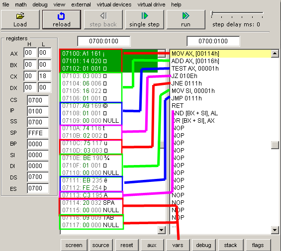

# Domaći zadatak 1 - paran broj

Leon Laci 22/19

## Kod

```x86asm
org 100h

num1 dw 32
num2 dw 9

; saberi
mov ax, num1
add ax, num2

; da li je zadnji bit setovan
test ax, 1

; ako je rezultat 0, onda je paran
jz even
; ako je rezultat 1, broj je neparan
jnz exit

even:
    mov si, 1

exit:
    jmp exit

ret
```

## Mašinski kod

```x86asm
[   1]        :                                       org 100h
[   2]        :                                       
[   3]        :                                       ; saberi
[   4]    0100: A1 14 01                              mov ax, num1
[   5]    0103: 03 06 16 01                           add ax, num2
[   6]        :                                       
[   7]        :                                       ; da li je zadnji bit setovan
[   8]    0107: A9 01 00                              test ax, 1
[   9]        :                                       
[  10]        :                                       ; ako je rezultat 0, onda je paran
[  11]    010A: 74 02                                 jz even
[  12]        :                                       ; ako je rezultat 1, broj je neparan
[  13]    010C: 75 03                                 jnz exit
[  14]        :                                       
[  15]    010E:                                       even:
[  16]    010E: BE 01 00                              mov si, 1
[  17]        :                                       
[  18]    0111:                                       exit:
[  19]    0111: EB FE                                 jmp exit
[  20]        :                                       
[  21]    0113: C3                                    ret
[  22]        :                                       
[  23]    0114: 20 00                                 num1 dw 32
[  24]    0116: 08 00                                 num2 dw 8
[  25]        :                                       
[  26]        :                                       
```

## Slika sa objašnjenjem



## Odgovori na pitanja

### Koliko bajtova zauzima svaka napisana instrukcija?

Svaki red u levom prozoru predstavlja jedan bajt.

* `MOV AX, [00114h]` - 3
* `ADD AX, [00116h]` - 4
* `TEST AX, 00001h` - 3
* `JZ 010Eh` - 2
* `JNE 0111h` - 2
* `MOV SI, 00001h` - 3
* `JMP 0111h` - 2
* `RET` - 1

I još dve promeljive, svaka zauzima još 2 bajta.

### Kakav je status flegova nakon što se rezultat prebaci u AX registar? Zašto?

Svi flagovi su setovani na 0. Osim `IF` flaga (procesor prepoznaje prekide).

Posle `add` operacije se menja `PF` flag (parity flag). Ako je posle operacije rezultat broj sa parnim brojem jedinica onda se `PF` stavlja na 1, u suprotnom je 0.

* `CF` - Carry flag
* `ZF` - Zero flag
* `SF` - Sign flag
* `OF` - Overflow flag
* `AF` - Auxiliary flag
* `IF` - Interrupt flag
* `DF` - Direction flag
